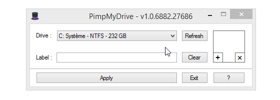

# PimpMyDrive

## About
Windows tool to set custom icons and labels for fixed, USB / removable and network drives with `autorun.inf` file.



## Features

- Add / edit / delete drives:
  - Custom icon
  - Display name
- Created `autorun.inf` and icon files are hidden
- Fully portable, no rights / setup needed
- No administrator rights needed
- Free, copyleft license
  
:bulb: Due to Windows cache, you might need to eject your drive then plug it back to see changes.

## Requirements
- Microsoft [.NET Framework 4](https://www.microsoft.com/en-US/download/details.aspx?id=17851)
- Microsoft Windows Vista or later

## Todo
- Localization
- Threading for disk I/O
- Support for `open` and `action`:

```ini
[AutoRun]
open=autorun.exe
action=Start autorun.exe
```

## Libraries
- Top Hat emoji :tophat: from [Twemoji](https://github.com/twitter/twemoji)
- INI reader / writer class from [Ludvik Jerabek](https://www.codeproject.com/Articles/21896/INI-Reader-Writer-Class-for-C-VB-NET-and-VBScript) (I fixed encoding issues)

## License
PimpMyDrive is released under the [GNU General Public License v3.0](https://www.gnu.org/licenses/gpl-3.0.fr.html).
